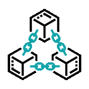

<h1> Hello👋, I'm  <a href="https://yoshepchan490.github.io">Yoshep chan</a> </h1>
<h2><a href="https://yoshepchan490.github.io">AI + Full Stack Developer</a></h2> 

-   🔭 I’m currently working on Full Stack Development
-   🌱 I’m currently learning AI and Machine Learning
-   👯 I’m looking to collaborate on Web Development and Blockchain Industry
-    Ask me about Computer Science
-   ❤️ I am passionate about Software Engineering
-   💻 I enjoy learning new things & sharing knowledge
##      Connect with me!  

 

##  Programming Languages:

  
  
  
  
  
 

<table align="center">
   <tr align="left">
    <th> <b>🚶 Frontend Development: </b></th> 
    <th> <b>🔙 Backend Development: </b></th>
   </tr>
  <tr>
    <td>
     
       
         
    

   </td>
      <td>
          
         

      </td>
   </tr>
   <tr align="left">
        <th><b>👨‍💻Development Tools:</b></th>
        <th> <b>📱Databases & Cloud Hosting:</b></th>
   </tr>
  <tr>
    <td>
            
 
             
                  
            
             
         

    </td>
    <td>
          

                  
        

    </td>
 </tr>
 </table>

##  Blockchain :
     
     

##   Software and Tools:

                   

 
##  Yoshep Chan's Github Stats 

|  |  |
| --------------------------------------------------------------------------------------------------------------------------------------------------------------------------------------------------------------------------- | --------------------------------------------------------------------------------------------------------------------------------------------------------------------------------------------------------------- |

 
<b>📓 Notes:</b> <i>Top languages is only a metric of the languages my public code consists of and doesn't reflect experience or skill level.</i>
 
 

Thanks for going through My Portfolio. All rights reserved by Yoshep Chan @2024

